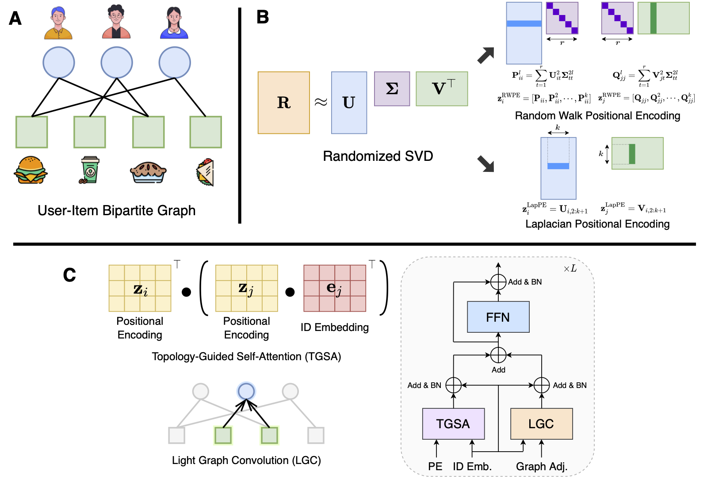

# ToBE

This is the PyTorch implementation of **Topology-guided Graph Transformer for Recommender Systems**.



## Requirements

- Environment:
  - Python 3.10.8
  - Nvidia RTX 4090 with CUDA 12.1

- Libraries:
  - torch == 2.1.2
  - torch_geometric == 2.4.0
  - numpy == 1.26.3
  - scikit-learn == 1.4.1.post1
  - scipy == 1.12.0
  - googledrivedownloader == 0.4

## How to run

The commands and hyperparameter settings are provided in the `run.sh` script. The datasets will be automatically downloaded from the internet during program execution. Make sure the folder `data` exists in the root directory.

To reproduce the results reported in our paper, please follow the two steps below:

### Step 1: Preprocessing

Run the following commands to preprocess the raw datasets. This step performs data filtering and precomputes the positional encodings for each node.

```shell
cd src/preprocess
for dataset in Yelp Gowalla AmazonBook Tmall Movielens1M AlibabaIFashion; do
    python3 preprocess.py --dataset $dataset --do_filtering
done
```

### Step 2: Run Recommendation Model

After preprocessing, execute the recommendation model with the corresponding hyperparameter settings for each dataset:

```shell
cd src/task
python3 recommend.py --dataset Yelp --lr 0.0005 --lambda_reg 0.1 --lambda_au 0.5 --train_batch_size 2048 --num_layers 3
python3 recommend.py --dataset Gowalla --lr 0.001 --lambda_reg 0.1 --lambda_au 0.5 --train_batch_size 2048 --num_layers 3
python3 recommend.py --dataset AmazonBook --lr 0.001 --lambda_reg 0.1 --lambda_au 1 --train_batch_size 1024 --num_layers 3
python3 recommend.py --dataset Tmall --lr 0.001 --lambda_reg 0.1 --lambda_au 10 --train_batch_size 2048 --num_layers 3
python3 recommend.py --dataset Movielens1M --lr 0.0005 --lambda_reg 0.1 --lambda_au 0.5 --train_batch_size 2048 --num_layers 3
python3 recommend.py --dataset AlibabaIFashion --lr 0.001 --lambda_reg 0.2 --lambda_au 0.5 --train_batch_size 2048 --num_layers 3
```

## Results


